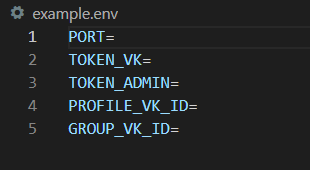
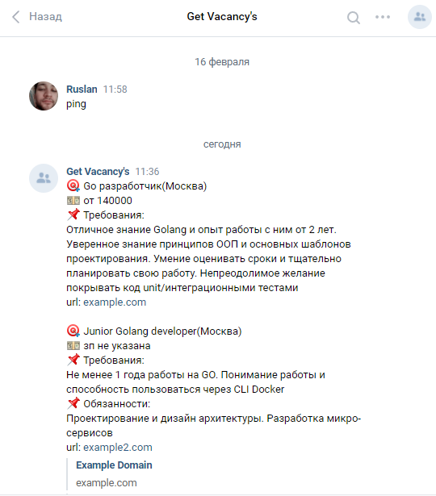
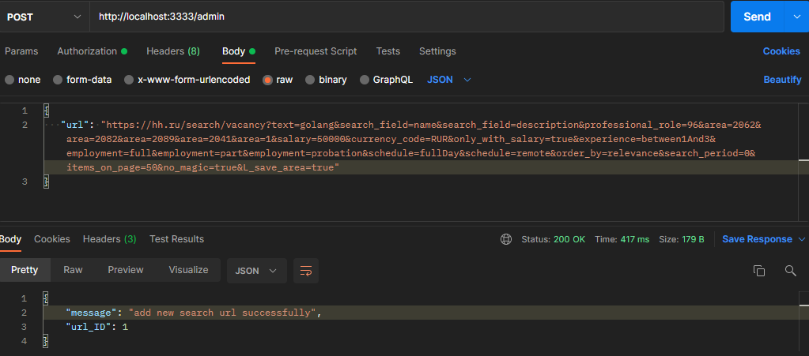
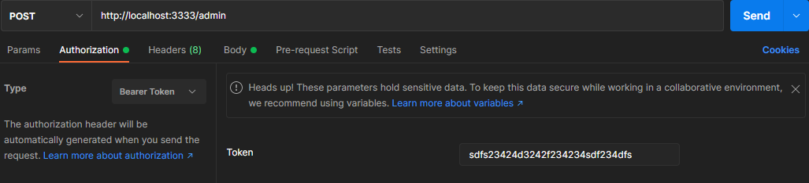

## Head Hunter parser ***(v1.0)***

Данный проект сделан для портфолио

### Что умеет данная программа:
* Собирать данные с API вакансий по поисковым ссылкам
* Следить за обновлениями результатов поиска
* Уведомлять о новых вакансиях в ВКонтакте

### Подготовка окружения:

1. Зайдите в группу ВКонтакте от которой вы будете получать сообщения. Выберите **Управление** -> **Работа с API** -> **Создать ключ**. У ключа должны быть права на управление сообществом. Вставьте его в переменную **TOKEN_VK**
2. Скопируйте id группы и вставьте в **GROUP_VK_ID**
3. Скопируйте id профиля, куда будут приходить сообщения, и вставьте в **PROFILE_VK_ID**
4. Придумайте ключ для доступа к POST и DELETE запросам и запишите в **TOKEN_ADMIN**


### Как запустить:
1. Клонируйте репозиторий
```
git clone https://github.com/RuslanU1703/pet-hh-parser
```
2. Откройте проект в среде разработки
3. Заполните **example.env** вашими данными и переименуйте его в **app.env**
4. Произведите тесты
```
go test ./...
```
Данная команда выполнит все тесты проекта, на данный момент добавлено только тестирование отправки сообщений в ВК.
Если ваши данные из **app.env** валидны, вам придет сообщение от имени группы





> Согласно политики ВКонтакте, сообщество может отправлять сообщения, только тем пользователям, которые дали разрешение на отправку сообщений. Если пользователь инициировал беседу - это приравнивается к согласию
5. Запустите проект
```
go run cmd/main.go
```
6. Работа с поисковыми ссылками
* Добавить ссылку<br>
Зайдите на [сайт HeadHunter](https://hh.ru/) и скопируйте ссылку на интересующий поиск. Далее отправьте POST запрос на сервер, передав свой **TOKEN_ADMIN** в заголовке запроса, а в теле запроса ссылку в формате json


* Удалить ссылку<br>
Выполните DELETE запрос с теми же данными, но в теле запроса передайте **id** ссылки, который вы получили при ее добавлении
7. Частота запросов к API<br>
По умолчанию приложение отправляет запрос к HeadHunter API раз в 3 часа. Запрос к ВКонтакте API, происходит лишь в том случае, если по заданному поиску есть новые вакансии, которые еще не присылались. Поменять частоту запросов к HeadHunter API можно в переменной **callFrequencyTime** в файле **app.go**


### Видео презентация:

> В процессе создания

